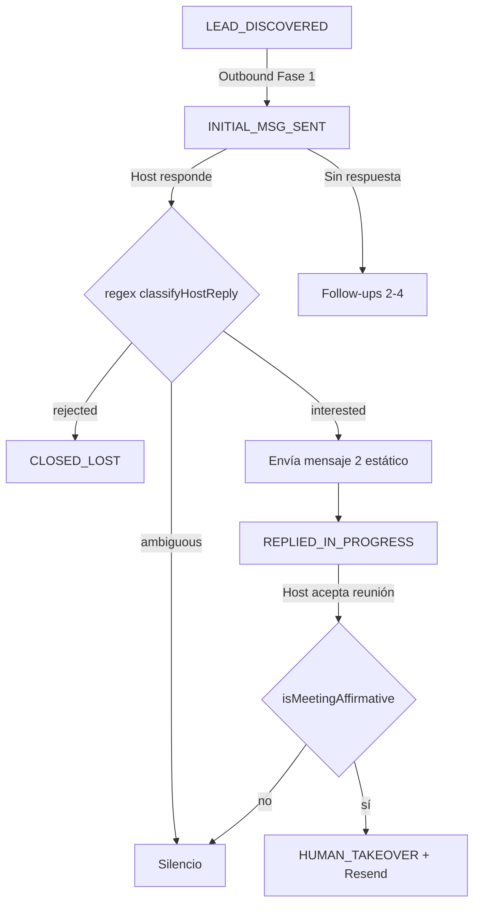

# Operación de prospección Airbnb — Contexto, estado y próximos pasos

Documento de referencia que consolida lo acordado en pruebas manuales, decisiones operativas y aclaraciones recientes. Complementa [`ESTADO-PROYECTO.md`](./ESTADO-PROYECTO.md) (inventario técnico) con la **lógica de negocio real** que el código debe reflejar.

---

## 1. Objetivo del sistema

Automatizar el embudo completo de prospección en Airbnb Colombia:

```
Harvest → Outbound frío → Respuesta del host → Mensaje 2 → Handoff humano → CRM/Dashboard
```

**Meta operativa (escala):** ~**600** primeros mensajes fríos por semana con **5 cuentas** en rotación 24/7, cada una con IP residencial Decodo distinta.

**Meta operativa (arranque):** ~100 prospectos/semana con 2 cuentas — fase de validación ya superada.

**Mercados activos:** **Bogotá** y **Medellín** como base para ~600/semana. **Cali** como 3.er mercado si se quiere diversificar inventario. **Bucaramanga** opcional si el pipeline ICP se agota. **Cartagena** queda fuera del ICP operativo.

---

## 2. Modelo operativo acordado (fuente de verdad)

Estas reglas provienen de pruebas manuales reales y tienen prioridad sobre el diseño original (Cal.com + IA conversacional libre).

### 2.1 Mensajería — sin IA en conversación

| Etapa | Comportamiento |
|-------|----------------|
| **Mensaje 1 (frío)** | Plantilla **estática**. Solo variables: `{nombre}` y `{superanfitrión/a}`. |
| **Respuesta del host** | Clasificación **regex** (rechazo / interés / ambiguo). Sin LLM. |
| **Interés detectado** | Enviar **mensaje 2 estático** (curiosidad / explicación de plataforma). |
| **Rechazo** | `CLOSED_LOST`, silencio. |
| **Ambiguo** | Silencio (no responder). |
| **Tras mensaje 2 + aceptación de reunión** | `HUMAN_TAKEOVER` + notificación por **Resend** a `svaron066@gmail.com`. |

Los follow-ups de fases 2–4 también son plantillas estáticas (sin Cal.com en fases 1–3).

### 2.2 ICP (Ideal Customer Profile)

| Criterio | Valor | Notas |
|----------|-------|-------|
| Propiedades | **10–25** | Operadores con dolor operativo real, no hobbyistas ni mega-operadores. |
| Perfil | **Superanfitrión** | El copy del mensaje 1 asume superhost; debe validarse y persistirse. |
| Excluir | Hoteles, lofts masivos, operadores tipo cadena | Detectar por nombre de listing, amenities, volumen atípico o keywords en perfil. |
| Ciudades | Bogotá, Medellín (+ Cali/Bucaramanga opcional) | No Cartagena en producción. Ver §2.5 reparto por ciudad. |
| Deduplicación | Por `hostAirbnbId` | Ya implementado en CRM. |

> **Aclaración (2026-07):** los filtros ICP **no se configuran con variables de entorno**. Deben ser **constantes estáticas en código** (p. ej. `src/discovery/icp.ts`) para que el criterio sea explícito, auditable y no cambie accidentalmente entre entornos.

Valores estáticos propuestos:

```typescript
export const ICP = {
  MIN_PROPERTIES: 10,
  MAX_PROPERTIES: 25,
  REQUIRE_SUPERHOST: true,
  MARKETS: ['Bogotá', 'Medellín'] as const,
  OPTIONAL_MARKETS: ['Cali', 'Bucaramanga'] as const,
  EXCLUDED_KEYWORDS: ['hotel', 'hostel', 'loft industrial', 'aparta hotel', /* … */],
} as const
```

### 2.3 Límites de Airbnb (observados en pruebas)

| Situación | Comportamiento |
|-----------|----------------|
| Cuenta establecida | ~**10–15 mensajes** antes de bloqueo por varias horas. |
| Misma IP + cuenta nueva | ~**4–5 mensajes** antes de bloqueo. |
| Verificación identidad | Modal de documento; resuelto manualmente en pruebas. |
| Rate limit diario | Copy: *"Ya le has escrito a varios anfitriones… espera unas horas"*. |

**Estrategia de cuentas:** rotación en **cascada** (no paralelo). Una cuenta activa a la vez; al bloquearse, pasar a la siguiente. Cada cuenta con **IP residencial sticky** distinta (Decodo, 1 `session` id por cuenta).

#### Rotación por oleadas (factor clave de capacidad)

El límite de ~10–15 mensajes es **por oleada**, no por día entero. Tras el bloqueo (~5–6 h), la cuenta **recupera** y puede enviar otra oleada.

Ejemplo con 5 cuentas:

```
07:00–07:30   Cuenta 1  → ~10 msgs → bloqueo hasta ~13:00–14:00
07:30–08:00   Cuenta 2  → ~10 msgs → bloqueo
08:00–08:30   Cuenta 3  → ~10 msgs
08:30–09:00   Cuenta 4  → ~10 msgs
09:00–09:30   Cuenta 5  → ~10 msgs
              ─────────────────────────
              Oleada 1: ~50 msgs en ~2,5 h

14:00–14:30   Cuenta 1  → ~10 msgs (recuperada)
14:30–15:00   Cuenta 2  → ~10 msgs
   …
~16:30        Oleada 2: ~50 msgs más

21:00–23:00   Oleada 3 (si Airbnb lo permite): ~50 msgs más
```

Mientras una cuenta está en cooldown, las demás siguen en cascada. La capacidad diaria depende de **cuántas oleadas recupera cada cuenta**, no de un tope fijo de 10 msgs/día.

### 2.4 Tracking

- **`hostAirbnbId`** y URL de perfil: identificador único del prospecto (ya en DB).
- **`threadId`**: hilo de conversación post primer envío (ya en DB).
- El equipo debe usar el CRM para saber a quién ya se escribió.

#### Sincronización de cuentas manuales

Cuentas prospectadas a mano deben importarse al CRM para que el pipeline **no las vuelva a contactar**. El script `sync-account-conversations.ts` (solo lectura sobre Airbnb) recorre el inbox de cada `ProspectAccount`, reconstruye cada conversación, deja que la IA (Triaje) la clasifique y fija un estado seguro:

- **Rechazo** → `CLOSED_LOST`
- **Host interactuó** (interés/duda/ambiguo con respuesta) → `HUMAN_TAKEOVER` (IA pausada; humano continúa el hilo manual)
- **Sin respuesta del host** → `INITIAL_MSG_SENT`

**Red y proxy:** por defecto solo **outbound** y **login** (`auth:verify-account`) usan el proxy residencial de la cuenta. Harvest, inbound y sync van por **red directa** para ahorrar GB de Decodo. Playwright bloquea imágenes/media/fuentes/trackers (`PLAYWRIGHT_BLOCK_HEAVY_ASSETS`, default on). Antes de prospectar, re-autenticar con proxy (`auth:verify-account`) para anclar la sesión a la IP residencial.

```powershell
# Sincroniza las cuentas manuales conocidas (sin proxy por defecto)
npm run sync:accounts -w @repo/scraper

# Con proxy de cuenta (opt-in)
npx tsx apps/scraper/scripts/sync-account-conversations.ts <accountId> --use-account-proxy --max 50
```

Variables: `SYNC_USE_ACCOUNT_PROXY=false`, `SYNC_ACCOUNT_DELAY_MS=45000` (pausa entre cuentas en auto-login).

#### Extensión Chrome para validar CRM en Airbnb

La extensión `@repo/extension` evita duplicar contactos durante operación manual. Al cargar una conversación (`/guest/messages/*`), anuncio (`/rooms/*`) o perfil (`/users/show/*`), consulta `GET /api/leads/lookup` y monta una alerta en Airbnb:

- **Ya está en CRM:** muestra nombre, estado y enlace al pipeline (`/pipeline?leadId=...`).
- **No está en CRM:** permite registrar el prospecto con `POST /api/leads` sin salir de Airbnb.
- **Sin configuración o 401:** pide configurar URL del CRM y `DASHBOARD_TOKEN`.

Configuración local:

```powershell
npm run dev:extension
```

Luego abrir `chrome://extensions`, activar modo desarrollador y cargar la carpeta generada por WXT (`apps/extension/.output/chrome-mv3`). En opciones de la extensión:

- `CRM URL`: `http://localhost:3000` en local o la URL de Vercel en producción.
- `Dashboard token`: mismo valor que `DASHBOARD_TOKEN`.

La extensión guarda el token en `chrome.storage.local` y el service worker envía el header `x-dashboard-token`. No registrar el token en logs ni compartir builds con una configuración pre-cargada.

### 2.5 Capacidad de envío — 5 cuentas en rotación

Fórmula de planificación:

```
Contactos/semana ≈ cuentas × msgs_por_oleada × oleadas_por_día × 7 × factor_seguridad
```

| Parámetro | Valor operativo |
|-----------|-----------------|
| Cuentas | **5** |
| Msgs por oleada / cuenta | ~10 (tope observado 10–15) |
| Oleadas por día (objetivo) | 2 |
| Factor seguridad | 0,80–0,90 (bloqueos, identidad, ICP, cuentas nuevas) |

**Escenarios semanales (solo primer mensaje frío):**

| Escenario | Oleadas/día | Msgs fríos/semana |
|-----------|-------------|-------------------|
| Conservador | 1,5 | ~375–450 |
| **Operativo (planificar aquí)** | **2** | **~550–700** |
| Agresivo | 2,5–3 | ~850–900 (más riesgo de límite diario global) |

Ejemplo con factor 0,85:

```
5 × 10 × 2 × 7 × 0,85 ≈ 595 contactos/semana
```

**Equivalente diario:** ~**70–85** primeros mensajes/día repartidos entre cuentas y ciudades.

> **Cuentas nuevas:** en la misma IP solo aguantan ~4–5 msgs antes de bloqueo. Las cuentas recién onboarded no cuentan como oleada completa hasta estabilizarse.

#### Reparto por ciudad (~600 msgs/semana)

Con 5 cuentas el volumen baja; **2 ciudades bastan** para arrancar escala. Reparto acordado:

| Ciudad | Msgs/semana | % | Msgs/día (aprox.) | Rol |
|--------|-------------|---|-------------------|-----|
| **Bogotá** | ~300 | 50% | ~43 | Mayor mercado; más PMs medianos |
| **Medellín** | ~300 | 50% | ~43 | Hub STR maduro; alta densidad superhost |
| **Total** | **~600** | 100% | **~85** | |

**3.er mercado opcional** (si el CRM muestra < 1 semana de pipeline ICP en Bogotá + Medellín):

| Ciudad | Msgs/semana | Notas |
|--------|-------------|-------|
| **Cali** | ~150–200 | Redistribuir desde Bogotá/Medellín; total sigue ~600 |
| **Bucaramanga** | ~100–150 | Solo si Cali tampoco alcanza inventario ICP |

**Ciudades descartadas para este volumen/ICP:**

| Ciudad | Motivo |
|--------|--------|
| Cartagena / Santa Marta | Turismo, hoteles, aparta-hotel; fuera del ICP |
| Pereira / Manizales | Mercados pequeños; reservar si se escala cuentas |
| Barranquilla | Solo si Bucaramanga no alcanza; menos operadores 10–25 props |

**Regla operativa:** si una ciudad tiene **< 1 semana** de leads ICP en cola (`LEAD_DISCOVERED`), subir harvest ahí o abrir Cali/Bucaramanga — no concentrar más mensajes en una sola ciudad.

#### Referencia rápida: cuentas × ciudades

| Objetivo semanal | Cuentas activas | Ciudades |
|------------------|-----------------|----------|
| ~100 (arranque) | 2 | 2 |
| ~300–400 | 3–4 | 2 |
| **~550–700** | **5** | **2** (Bogotá + Medellín) |
| ~600 con pool agotado | 5 | 3 (+ Cali) |

---

## 3. Lo que ya está implementado

### 3.1 Pipeline de mensajes

| Componente | Archivo | Estado |
|------------|---------|--------|
| Plantillas frío + mensaje 2 + follow-ups | `apps/scraper/src/messaging/outbound-templates.ts` | ✅ |
| Clasificación regex (rechazo / interés / reunión) | `apps/scraper/src/conversation/reply-intent.ts` | ✅ Enriquecido (~40 rechazos, ~30 interés) |
| Orquestador sin LLM | `apps/scraper/src/conversation/run-conversation-turn.ts` | ✅ |
| Detección bloqueos al enviar | `apps/scraper/src/messaging/airbnb-messaging.ts` → `detectSendBlocker()` | ✅ Detecta rate limit e identidad |
| Envío vía `/contact_host/{id}/send_message` | `airbnb-messaging.ts` | ✅ |
| CRM + dashboard con datos reales | `apps/web`, `packages/db` | ✅ |
| 2FA vía Composio/Gmail | `tests/helpers/composio-gmail.ts`, `docs/composio.md` | ✅ Una sola cuenta |

### 3.2 Lo que el código hace hoy vs lo acordado

| Tema | Hoy | Debe ser |
|------|-----|----------|
| Filtro propiedades | ✅ **10–25 estático** en `icp.ts` | ~~`HARVEST_MIN_PROPERTIES` env~~ |
| Superhost | ✅ Campo `isSuperhost` en `Lead`; scrape + filtro harvest/outbound | ~~Solo inferencia por nombre~~ |
| Exclusión hotel/loft | ✅ `evaluateLeadIcp` + keywords en listing/company/bio | ~~No implementado~~ |
| Mercados | ✅ Default Bogotá + Medellín; Cartagena fuera; Cali/Bucaramanga opt-in | ~~Cartagena en default~~ |
| Rate limit | ✅ Evento en `AccountBlockEvent` + cuenta en `COOLDOWN` | ~~Solo detectar y lanzar error~~ |
| Multi-cuenta | Un solo `airbnb-session.json` | Modelo `ProspectAccount` + rotación |
| Proxies | Sin proxy | **Decodo** residencial sticky por cuenta |
| Onboarding cuenta | Script CLI `npm run auth:login` | **UI en dashboard** con Composio + formulario |
| Email reunión | ✅ Handoff Resend | `handoff-email.ts` + `applyHumanTakeover` |

---

## 4. Aclaraciones recientes (2026-07)

### 4.1 Filtros ICP estáticos ✅

- ~~Eliminar dependencia de `HARVEST_MIN_PROPERTIES`~~ — hecho; reglas en `apps/scraper/src/discovery/icp.ts`.
- Centralizar reglas en un módulo `icp.ts` importado por harvest, outbound y dashboard (filtros).
- Los env vars quedan solo para tuning operativo (batch size, delays), **no para el ICP**.

### 4.2 Superanfitrión en base de datos ✅

Implementado (2026-07-04):

1. `isSuperhost Boolean @default(false)` en `Lead` + enum `IcpSkipReason`.
2. Poblado en `upsertDiscoveredLead` desde `HostProfileStats.isSuperhost` (GraphQL + texto del perfil).
3. Outbound: `findEligibleColdLeads` exige `isSuperhost === true` y rango 10–25.
4. Cold outbound bloqueado en `buildOutboundMessage` si no cumple ICP.

### 4.3 Registrar bloqueos por rate limit ✅

Implementado (2026-07-04):

1. `AccountBlockEvent` con `type`, `message`, `occurredAt`.
2. `ProspectAccount` pasa a `COOLDOWN` (+ `cooldownUntil` 5 h) o `BLOCKED` (identidad).
3. Alerta Resend vía `notifyAccountCooldown` (log mock si falta API key).
4. Rotación automática a siguiente cuenta ✅ (Fase C: `pickNextAccount` + cascada en `outbound-run.ts`).

Propuesta de modelo (referencia):

```prisma
model ProspectAccount {
  id              String   @id @default(uuid())
  label           String   // "Cuenta 1", email visible, etc.
  airbnbEmail     String   @unique
  // credenciales: cifradas o referencia a secret manager
  composioUserId  String   // Gmail OAuth para OTP
  proxyHost       String?  // Decodo endpoint (gate.decodo.com)
  proxyPort       Int?
  proxyUser       String?  // user-…-session-…-sessionduration-…
  proxyPassEnc    String?
  proxyProvider  String?  // "decodo"
  proxySessionId  String?  // sticky session id único por cuenta
  proxyCountry    String?  // ISO-2, p.ej. "co"
  sessionPath     String?  // ruta al storage state de Playwright
  messagesSentToday Int    @default(0)
  status          AccountStatus @default(ACTIVE)
  rateLimitedAt   DateTime?
  createdAt       DateTime @default(now())
  updatedAt       DateTime @updatedAt
  blockEvents     AccountBlockEvent[]
}

model AccountBlockEvent {
  id          String   @id @default(uuid())
  accountId   String
  account     ProspectAccount @relation(...)
  type        BlockType  // RATE_LIMIT | IDENTITY | CAPTCHA | OTHER
  message     String   @db.Text
  occurredAt  DateTime @default(now())
}
```

### 4.4 Proxies residenciales — Decodo

- Proveedor acordado: **Decodo** (ex-Smartproxy), residential sticky.
- Endpoint: `gate.decodo.com:7000`. Targeting Colombia: `country-co` en el username.
- **Una sticky session por cuenta** Airbnb (`session-<id>` distinto; no compartir entre cuentas).
- Sticky hasta 24 h (`sessionduration-1440`). Si el nodo residencial cae, la IP puede rotar antes.
- Playwright se lanza con `proxy: { server, username, password }` desde `ProspectAccount`.
- Credenciales del plan (`DECODO_USERNAME` / `DECODO_PASSWORD`) viven en `.env` solo para el script de asignación; por cuenta se guardan en `ProspectAccount`.
- Asignación: `npm run proxy:assign-decodo` (opcional `--dry-run`, `--test-only`, `--email`).

### 4.5 Interfaz de onboarding de cuentas

Flujo acordado para conectar una cuenta nueva desde el **dashboard**:

```
┌─────────────────────────────────────────────────────────────┐
│  Dashboard → Configuración → Cuentas de prospección         │
└─────────────────────────────────────────────────────────────┘
                              │
                              ▼
              ┌───────────────────────────────┐
              │  Botón: "Conectar Gmail"      │
              │  → Abre OAuth Composio        │
              │  → Guarda composioUserId      │
              └───────────────────────────────┘
                              │
                              ▼
              ┌───────────────────────────────┐
              │  Formulario:                  │
              │  • Email Airbnb               │
              │  • Contraseña Airbnb          │
              │  • Proxy Decodo (opcional    │
              │    o auto-asignado)           │
              │  • Etiqueta de cuenta         │
              └───────────────────────────────┘
                              │
                              ▼
              ┌───────────────────────────────┐
              │  Worker de verificación:      │
              │  • Login Playwright headless  │
              │  • 2FA vía Composio/Gmail    │
              │  • Guarda session + ACTIVE    │
              └───────────────────────────────┘
```

**Requisitos:**

- Composio resuelve OTP de Airbnb vía Gmail (`docs/composio.md`).
- Cada cuenta tiene su propio `composioUserId` (`prospect-{accountId}`) conectado desde el dashboard (**Conectar Gmail**).
- El inbox de Gmail conectado debe ser el que recibe los OTP de Airbnb para ese email.
- Tras login exitoso (manual por ahora), persistir `playwright/.auth/account-{id}.json` (o blob en DB/S3).
- La UI muestra estado: `PENDING_GMAIL` → `PENDING_CREDENTIALS` → `ACTIVE` | `BLOCKED` (`VERIFYING` en iteración posterior).

---

## 5. Próximo paso de implementación (orden recomendado)

La secuencia minimiza riesgo: primero corregir calidad del embudo (ICP + datos), luego infraestructura de cuentas, luego escala 24/7.

### Fase A — ICP y datos de lead ✅ *2026-07-04*

| # | Estado | Tarea | Detalle |
|---|--------|-------|---------|
| A1 | ✅ | `src/discovery/icp.ts` | Constantes estáticas: 10–25 props, superhost, keywords, mercados, `OPERATIONS`. |
| A2 | ✅ | Migración Prisma | `Lead.isSuperhost`, `Lead.market`, `Lead.icpSkipReason`. |
| A3 | ✅ | Harvest | `isSuperhost` del scrape; filtros ICP; skip con razón documentada. |
| A4 | ✅ | Outbound | `findEligibleColdLeads` usa ICP estático (no env). |
| A5 | ✅ | Mercados | Default Bogotá + Medellín; Cali/Bucaramanga opt-in. |
| A6 | ✅ | Plantillas | Cold bloqueado si lead no cumple ICP. |

**Entregable:** leads en DB cumplen ICP real antes de cualquier contacto. **Pendiente operativo:** `npm run db:migrate` en cada entorno.

### Fase B — Persistencia de bloqueos ✅ *2026-07-04*

| # | Estado | Tarea | Detalle |
|---|--------|-------|---------|
| B1 | ✅ | Modelo `AccountBlockEvent` + `ProspectAccount` | Enums `BlockType`, `AccountStatus`. |
| B2 | ✅ | Hook en outbound | `handleAccountBlock` al capturar `AirbnbSendBlockedError`. |
| B3 | ✅ | Alertas | Resend al cooldown (`notifyAccountCooldown`). |

**Entregable:** visibilidad de cuándo y por qué se frenó el outbound. **Setup:** `npm run seed:legacy-account` + `npm run db:migrate`.

### Fase C — Multi-cuenta + Decodo ✅ *2026-07-04* (proxy migrado a Decodo 2026-07-16)

| # | Estado | Tarea | Detalle |
|---|--------|-------|---------|
| C1 | ✅ | Modelo `ProspectAccount` completo | `airbnbPasswordEnc`, `proxyPassEnc`, `DailyOutboundStats`, `Message.prospectAccountId`. |
| C2 | ✅ | Selector de cuenta activa | `account-selector.ts`: cascada por `waveMessagesSent` + cooldown. |
| C3 | ✅ | Playwright context por cuenta | `playwright-context.ts`: proxy Decodo + storage state por cuenta. |
| C4 | ✅ | Rotación automática | `outbound-run.ts` + `account-reaper.ts` (cron QStash cada 15 min). |
| C5 | ✅ | Límite ~10 msgs/oleada/cuenta | `OPERATIONS.MSGS_PER_WAVE` + `completeWave`. |
| C6 | ✅ | Reparto por ciudad | Cuotas Bogotá/Medellín 43/43 vía `DailyOutboundStats`. |
| C7 | ✅ | Dashboard cuentas (manual) | `/settings/accounts` + API `/api/accounts` (sin Composio OAuth). |

**Entregable:** operación sostenida más allá de una sola sesión. **Setup:** `CREDENTIALS_ENCRYPTION_KEY` + `npm run db:migrate` + alta manual en dashboard.

### Fase D — UI onboarding Composio ✅ *parcial 2026-07-04*

| # | Estado | Tarea | Detalle |
|---|--------|-------|---------|
| D1 | ✅ | Página `/settings/accounts` | Lista + columna Gmail + estados. |
| D2 | ✅ | Botón Composio Connect | `POST /api/accounts/{id}/composio/connect` + callback HMAC. |
| D3 | ✅ | OTP por cuenta | `@repo/composio` + `auth:otp-test --account-id`. |
| D4 | ⏳ | Job `verify-account-login` | Login Playwright headless + proxy (siguiente iteración). |
| D5 | ✅ | Form email/contraseña/proxy | Alta manual en dashboard (Fase C). |

**Entregable:** conectar Gmail por cuenta sin `COMPOSIO_USER_ID` en `.env`. **Setup:** `COMPOSIO_GMAIL_AUTH_CONFIG_ID`, `APP_URL`, `npm run db:migrate`.

### Fase E — Cierre del embudo humano

| # | Tarea | Detalle |
|---|-------|---------|
| E1 | ✅ Resend en `HUMAN_TAKEOVER` | Email handoff con plantilla §8.2 + deep link `/pipeline?leadId=` |
| E2 | Despliegue prod 24/7 | QStash + workers con mutex por cuenta (no global único). |

---

## 6. Flujo conversacional (referencia rápida)



---

## 7. Copy de mensajes (referencia)

### Mensaje 1 — Frío

> ¡Hola {nombre}! Noté que eres {superanfitrión/a}. Hemos implementado en Property Managers como tu un sistema que libera más de 100 horas semanales, recupera caja que se pierde y aumenta reseñas positivas de tus huéspedes. ¿Tienes 5 minutos para comentarte qué es y cómo funciona?

### Mensaje 2 — Curiosidad (tras interés)

Definido en `buildCuriosityReplyMessage()` — estático, menciona la plataforma.

### Handoff humano

Cuando el host confirma reunión tras el mensaje 2, el bot deja de responder y el equipo recibe un email vía **Resend** (`HANDOFF_EMAIL`, default `svaron066@gmail.com`) con asunto `[Handoff] {nombre} — {props} props — {market}`.

Preview sin enviar:

```bash
npm run handoff:dry-run -- --lead-id <uuid>
npm run handoff:dry-run -- --lead-id <uuid> --send   # envío real
```

El email incluye link al dashboard: `/pipeline?leadId={uuid}`.

---

## 8. Comandos útiles (estado actual)

```powershell
# Liberar mutex Playwright
npx tsx apps/scraper/scripts/release-mutex.ts

# Simular conversación con navegador visible
npx tsx apps/scraper/scripts/conversation-guided-run.ts --headed <leadId>

# Dry-run regex sin enviar
npx tsx apps/scraper/scripts/conversation-dry-run.ts <leadId> "Dale, cuéntame más"

# Preview email handoff (sin enviar)
npm run handoff:dry-run -- --lead-id <leadId>

# Login manual (hoy: una sola cuenta)
npm run auth:login

# Tests unitarios
npm run test:unit -w @repo/scraper
```

Lead de prueba frecuente: Juan Jose — `d4bee589-11a5-4131-9236-38dbb803aad7` (65 props; fuera de ICP 10–25, útil para pruebas técnicas).

---

## 9. Decisiones explícitas vs descartadas

| Decisión | Estado |
|----------|--------|
| Mensajes estáticos (no IA en conversación) | ✅ Acordado e implementado |
| Cal.com en mensajes fríos | ❌ Descartado |
| Regex para clasificar respuestas | ✅ Acordado e implementado |
| ICP vía variables de entorno | ❌ Descartado → **estático en código** ✅ |
| Multi-cuenta en paralelo | ❌ Descartado → **cascada** |
| Proxies datacenter | ❌ Descartado → **Decodo residencial sticky** |
| Onboarding solo CLI | ❌ Descartado → **UI dashboard + Composio** |
| Notificaciones Slack | ❌ Descartado → **solo Resend** |
| Cartagena como mercado | ❌ Descartado en operación |
| Capacidad sin rotación por oleadas | ❌ Descartado — la capacidad real = oleadas recuperables/día |
| ~600 msgs/semana con 5 cuentas | ✅ Objetivo operativo con 2 oleadas/día |
| Cali como 3.er mercado | ⚠️ Opcional si pipeline ICP < 1 semana en 2 ciudades |
| Bucaramanga como 4.º mercado | ⚠️ Opcional si Cali tampoco alcanza |

---

## 10. Referencias en el repo

| Documento / módulo | Contenido |
|--------------------|-----------|
| [`PLAN-IMPLEMENTACION.md`](./PLAN-IMPLEMENTACION.md) | Plan técnico por fases, tareas, DoD y PRs |
| [`ESTADO-PROYECTO.md`](./ESTADO-PROYECTO.md) | Inventario técnico (puede estar desactualizado en dashboard/API) |
| [`composio.md`](./composio.md) | Integración Gmail/OTP para 2FA |
| `apps/scraper/src/conversation/reply-intent.ts` | Patrones regex enriquecidos |
| `apps/scraper/src/discovery/icp.ts` | Constantes ICP + `evaluateLeadIcp()` |
| `apps/scraper/src/messaging/outbound-templates.ts` | Copy estático |
| `packages/db/prisma/schema.prisma` | Schema CRM actual |

---

*Última actualización: 2026-07-04 — Fases A, B y C implementadas; Fase D parcial (Composio Connect + OTP por cuenta).*
