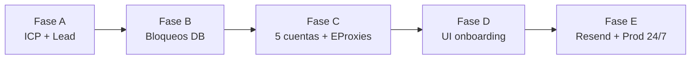

# Plan de implementación — Prospección Airbnb

Plan técnico derivado de [`OPERACION-PROSPECCION.md`](./OPERACION-PROSPECCION.md). Define **qué construir, en qué orden, dónde tocar código y cómo validar** cada entrega.

---

## 1. Resumen ejecutivo

| Aspecto | Definición |
|---------|------------|
| **Objetivo** | Embudo automatizado: harvest → outbound frío → respuesta regex → mensaje 2 → handoff humano |
| **Meta operativa** | ~**600** primeros mensajes fríos/semana con **5 cuentas** en rotación por oleadas |
| **Mercados** | Bogotá + Medellín (Cali/Bucaramanga opt-in) |
| **ICP** | Superhost, 10–25 props, sin hotel/loft — **constantes estáticas en código** |
| **Conversación** | Plantillas estáticas + regex (sin LLM en runtime) |
| **Notificaciones** | Solo **Resend** → `svaron066@gmail.com` |
| **Proxies** | **EProxies** residencial, 1 IP fija por cuenta |
| **Onboarding cuentas** | Dashboard + Composio (Gmail/OTP) + credenciales Airbnb |

### Estado actual vs objetivo

| Área | Implementado | Pendiente |
|------|--------------|-----------|
| Mensajería + regex | ✅ | — |
| CRM + dashboard | ✅ | — |
| ICP real (10–25, superhost) | ✅ | — |
| `isSuperhost` en DB | ✅ | — |
| Persistencia rate limits | ✅ | — |
| Multi-cuenta + rotación | ✅ | — |
| EProxies por cuenta | ✅ | — |
| UI onboarding Composio | ✅ parcial | Fase D (Connect + OTP; verify login pendiente) |
| Resend en handoff | ✅ | Fase E parcial (handoff email); prod 24/7 pendiente |
| Prod 24/7 con 5 cuentas | ❌ | Fase E |

---

## 2. Principios de implementación

1. **ICP en código, no en env** — un solo módulo `icp.ts` importado por harvest, outbound y tests.
2. **Cascada, no paralelo** — una sesión Playwright activa; rotar cuenta al bloqueo o fin de oleada.
3. **Oleadas, no tope diario plano** — ~10 msgs/oleada/cuenta; reactivar tras cooldown (~5–6 h).
4. **Cambios mínimos por fase** — cada fase tiene entregable verificable antes de la siguiente.
5. **Sin Slack** — todas las alertas operativas vía Resend.

---

## 3. Mapa de fases



| Fase | Nombre | Duración estimada | Dependencias |
|------|--------|-------------------|--------------|
| **A** | ICP y datos de lead | 3–5 días | — ✅ *2026-07-04* |
| **B** | Persistencia de bloqueos | 2–3 días | A ✅ *2026-07-04* |
| **C** | Multi-cuenta + EProxies + rotación | 5–8 días | A, B ✅ *2026-07-04* |
| **D** | UI onboarding Composio | 4–6 días | C (modelo `ProspectAccount`) |
| **E** | Resend + despliegue 24/7 | 3–5 días | C, D parcial |

**Total estimado:** 17–27 días de desarrollo (1 dev), más prueba operativa con cuentas reales.

---

## 4. Fase A — ICP y datos de lead ✅

**Objetivo:** Ningún lead fuera de ICP llega a outbound. Superhost persistido en DB.

**Estado:** implementado el 2026-07-04. Migración `20260704180000_add_lead_icp_fields`. Tests unitarios del scraper: 110 passing.

### 4.1 Tareas

| ID | Estado | Tarea | Archivos | Criterio de aceptación |
|----|--------|-------|----------|------------------------|
| A1 | ✅ | Módulo ICP estático | `apps/scraper/src/discovery/icp.ts` | Exporta `ICP`, `OPERATIONS`, `evaluateLeadIcp()`, `isLeadOutboundEligible()` |
| A2 | ✅ | Migración Prisma | `packages/db/prisma/schema.prisma` | `Lead.isSuperhost`, `Lead.market`, `Lead.icpSkipReason` (enum `IcpSkipReason`) |
| A3 | ✅ | Scrape superhost | `airbnb-host.ts`, `harvester.ts` | `HostProfileStats.isSuperhost` vía GraphQL + texto; se pasa a `upsertDiscoveredLead` |
| A4 | ✅ | Filtro en harvest | `lead-repository.ts`, `harvester.ts` | Skip: `below_min`, `above_max`, `not_superhost`, `hotel_loft`, `wrong_market` |
| A5 | ✅ | Filtro hotel/loft | `icp.ts` + harvest | Keywords en listing, company, bio; tests en `icp.test.ts` |
| A6 | ✅ | Outbound elegible | `outbound-pipeline.ts` | Sin `HARVEST_MIN_PROPERTIES`; usa `ICP.MIN/MAX`, `REQUIRE_SUPERHOST` |
| A7 | ✅ | Mercados | `markets.ts` | Default Bogotá + Medellín; Cartagena fuera; Cali/Bucaramanga con `ICP_INCLUDE_OPTIONAL_MARKETS=true` |
| A8 | ✅ | Plantillas | `outbound-templates.ts` | Cold bloqueado si lead no cumple ICP (`isColdLeadEligible`) |
| A9 | ✅ | Tests | `icp.test.ts`, `markets.test.ts`, outbound/host tests | 9→skip, 15 superhost→ok, 30→skip, "Hotel XYZ"→skip |
| A10 | ✅ | Dashboard | `apps/web` kanban + `prisma-repository` | Badge Superhost; filtros `minProperties` / `maxProperties` / `superhostOnly` |

### 4.2 Constantes objetivo (`icp.ts`)

```typescript
export const ICP = {
  MIN_PROPERTIES: 10,
  MAX_PROPERTIES: 25,
  REQUIRE_SUPERHOST: true,
  MARKETS: ['Bogotá', 'Medellín'] as const,
  OPTIONAL_MARKETS: ['Cali', 'Bucaramanga'] as const,
  EXCLUDED_KEYWORDS: [
    'hotel', 'hostel', 'aparta hotel', 'apartahotel',
    'loft industrial', 'resort', 'motel',
  ] as const,
} as const

export const OPERATIONS = {
  PROSPECT_ACCOUNTS: 5,
  MSGS_PER_WAVE: 10,
  WAVES_PER_DAY_TARGET: 2,
  COOLDOWN_HOURS: 5,
  CITY_DAILY_QUOTA: { 'Bogotá': 43, 'Medellín': 43 } as const,
} as const
```

### 4.3 Definition of Done — Fase A

- [x] `npm run test:unit -w @repo/scraper` pasa (110 tests, 2026-07-04)
- [ ] `db:migrate` aplicada en cada entorno (migración ya en repo; ejecutar `npm run db:migrate`)
- [x] Harvest run no crea leads con `<10` o `>25` props (`evaluateLeadIcp` en `upsertDiscoveredLead`)
- [x] Leads sin superhost quedan skip en harvest y no son elegibles en outbound
- [x] Ningún uso de `HARVEST_MIN_PROPERTIES` en lógica de negocio (`icp.ts` es la fuente de verdad)

---

## 5. Fase B — Persistencia de bloqueos ✅

**Objetivo:** Cada rate limit e identidad queda registrado; base para rotación automática.

**Estado:** implementado el 2026-07-04. Migración `20260704200000_add_prospect_accounts`. Tests: 117 passing.

### 5.1 Tareas

| ID | Estado | Tarea | Archivos | Criterio de aceptación |
|----|--------|-------|----------|------------------------|
| B1 | ✅ | Schema cuentas (mínimo) | `schema.prisma` | `ProspectAccount`, `AccountBlockEvent`, enums `AccountStatus`, `BlockType` |
| B2 | ✅ | Migración + seed | `scripts/seed-legacy-account.ts` | Cuenta legacy desde `AIRBNB_EMAIL` + `airbnb-session.json` |
| B3 | ✅ | Hook bloqueo | `airbnb-messaging.ts`, `outbound-run.ts` | `AirbnbSendBlockedError` → `handleAccountBlock()` |
| B4 | ✅ | Clasificar blocker | `airbnb-messaging.ts` | `classifyBlockType`: `RATE_LIMIT` \| `IDENTITY` \| `CAPTCHA` \| `OTHER` |
| B5 | ✅ | Pausar cuenta | `account-repository.ts` | `COOLDOWN` + `cooldownUntil` (5 h) o `BLOCKED` (identidad) |
| B6 | ✅ | Resend alerta | `resend.ts`, `notify.ts` | Email Resend al cooldown; log mock si falta `RESEND_API_KEY` |
| B7 | ✅ | Tests | `account-block.test.ts` | Clasificación + cooldown calculado |

### 5.2 Modelo Prisma (referencia)

Ver schema propuesto en `OPERACION-PROSPECCION.md` §4.3. Campos adicionales recomendados:

- `ProspectAccount.cooldownUntil DateTime?`
- `ProspectAccount.waveMessagesSent Int @default(0)` — contador oleada actual
- `ProspectAccount.lastWaveStartedAt DateTime?`

### 5.3 Definition of Done — Fase B

- [x] `AirbnbSendBlockedError` persiste fila en `AccountBlockEvent` vía `handleAccountBlock`
- [x] Alerta Resend (o log `alert.resend_skipped` si falta API key)
- [x] Cuenta pasa a `COOLDOWN` con `cooldownUntil` futuro (rate limit) o `BLOCKED` (identidad)
- [ ] Validación manual: probe con rate limit real → evento en DB (opcional en staging)

---

## 6. Fase C — Multi-cuenta, EProxies y rotación ✅ *2026-07-04*

**Objetivo:** 5 cuentas operando en cascada con ~600 msgs/semana (~85/día, 2 oleadas).

### 6.1 Tareas

| ID | Tarea | Archivos | Criterio de aceptación |
|----|-------|----------|------------------------|
| C1 | Completar `ProspectAccount` | `schema.prisma` | Credenciales cifradas (env `CREDENTIALS_ENCRYPTION_KEY` o secret manager) |
| C2 | Account selector | `apps/scraper/src/accounts/account-selector.ts` (nuevo) | `pickNextAccount()`: ACTIVE, `cooldownUntil` pasado, menor `waveMessagesSent` |
| C3 | Fin de oleada | `account-selector.ts` | Si `waveMessagesSent >= OPERATIONS.MSGS_PER_WAVE` → COOLDOWN + rotar |
| C4 | Reactivación cron | `account-reaper.ts` o job QStash | Cada 15 min: cuentas con `cooldownUntil < now` → ACTIVE, reset `waveMessagesSent` |
| C5 | Playwright por cuenta | `session-utils.ts`, `outbound-run.ts`, `harvest-run.ts`, `inbound-run.ts` | `launchContextForAccount(account)` con proxy EProxies + storage state |
| C6 | Proxy EProxies | `playwright-context.ts` (nuevo) | `proxy: { server, username, password }` desde `ProspectAccount` |
| C7 | Refactor auth | `tests/helpers/airbnb-auth.ts` | Acepta `accountId`, `composioUserId`, credenciales por cuenta |
| C8 | Cuotas por ciudad | `outbound-pipeline.ts` | `findEligibleColdLeads` filtra por `market` y cuota diaria (Bogotá 43, Medellín 43) |
| C9 | Contador diario | `Lead` o tabla `DailyOutboundStats` | Track msgs fríos/día/ciudad para no exceder cuota |
| C10 | Mutex por cuenta | `system-state.ts` | Mutex global → mutex por `accountId` o cola serial de sesiones |
| C11 | Integración runs | `outbound-run.ts` | Loop: pick account → batch hasta oleada o bloqueo → rotate |
| C12 | Tests | `account-selector.test.ts` | 5 cuentas, 1 en cooldown → devuelve la siguiente |

### 6.2 Flujo de rotación (implementación)

```
outbound-run:
  loop while hay leads elegibles:
    account = pickNextAccount()
    if !account → sleep / exit

    ctx = launchContextForAccount(account)
    sent = 0
    while sent < MSGS_PER_WAVE && hay leads:
      try send cold message
      sent++; increment waveMessagesSent
    catch AirbnbSendBlockedError:
      recordBlockEvent; set COOLDOWN; break

    if waveMessagesSent >= MSGS_PER_WAVE:
      set COOLDOWN until now + COOLDOWN_HOURS
    close ctx
```

### 6.3 Definition of Done — Fase C

- [x] 2 cuentas de prueba rotan en un run simulado (mock o staging)
- [x] Cada cuenta usa proxy distinto en logs de Playwright
- [x] Cuota Bogotá/Medellín respetada en un día de prueba (tests unitarios)
- [x] Capacidad teórica documentada: 5×10×2 = 100 msgs/día bruto
- [x] Dashboard `/settings/accounts` con alta manual (sin Composio OAuth en v1)

---

## 7. Fase D — UI onboarding Composio

**Objetivo:** Agregar cuentas 3–5 desde dashboard sin CLI.

### 7.1 Tareas

| ID | Tarea | Archivos | Criterio de aceptación |
|----|-------|----------|------------------------|
| D1 | Página cuentas | `apps/web/app/settings/accounts/page.tsx` | Lista: label, email, status, msgs hoy, cooldown |
| D2 | API cuentas | `apps/web/app/api/accounts/route.ts`, `[id]/route.ts` | GET list, POST create, PATCH status |
| D3 | Composio Connect | `apps/web/app/api/accounts/[id]/composio/connect`, `composio/callback` | ✅ OAuth por cuenta; persiste `composioUserId` + `composioConnectionId` |
| D4 | Form credenciales | componente en settings | Email Airbnb, password, label, proxy EProxies (4 campos) |
| D5 | Job verificación | `apps/scraper/scripts/verify-account-login.ts` | ⏳ Pendiente: login + 2FA Composio + guarda session |
| D6 | Estados UI | enum en UI | ✅ `PENDING_GMAIL` → `PENDING_CREDENTIALS` → `ACTIVE` (VERIFYING en iteración posterior) |
| D7 | Seguridad | API routes | Auth `DASHBOARD_TOKEN`; password nunca en logs; cifrado at-rest |
| D8 | E2E manual | checklist | Flujo completo: Connect Gmail → form → ACTIVE en <10 min |

### 7.2 Wireframe de estados

| Estado | Acción usuario | Sistema |
|--------|----------------|---------|
| `PENDING_GMAIL` | Click "Conectar Gmail" | OAuth Composio |
| `PENDING_CREDENTIALS` | Ingresa email/pass Airbnb + proxy | POST encriptado |
| `VERIFYING` | Espera | Worker Playwright + OTP |
| `ACTIVE` | — | Lista para rotación |
| `BLOCKED` | Revisar alerta Resend | Manual o re-verify identidad |

### 7.3 Definition of Done — Fase D

- [x] Conectar Gmail por cuenta desde `/settings/accounts` (OAuth Composio)
- [x] `composioUserId` + `composioConnectionId` persistidos en `ProspectAccount`
- [x] OTP por cuenta vía `npm run auth:otp-test -- --account-id <uuid>`
- [ ] Onboarding end-to-end con verificación Playwright automática (D5)
- [x] Documentación en `docs/composio.md` actualizada (multi-cuenta)

---

## 8. Fase E — Resend, handoff y producción 24/7

**Objetivo:** Cierre del embudo humano y operación continua con 5 cuentas.

### 8.1 Tareas

| ID | Tarea | Archivos | Criterio de aceptación |
|----|-------|----------|------------------------|
| E1 | ✅ Cliente Resend | `apps/scraper/src/notifications/resend.ts` | Envío transactional con `RESEND_API_KEY` |
| E2 | ✅ Handoff email | `handoff-email.ts`, `conversation-pipeline.ts` | `HUMAN_TAKEOVER` → email con plantilla §8.2 |
| E3 | ✅ Quitar Slack | `notify.ts` | Solo Resend en paths operativos |
| E4 | Cron harvest | `apps/web/app/api/cron/harvest/route.ts` | QStash cada 4 h; rotación mercados Bogotá/Medellín |
| E5 | Cron outbound | `api/cron/outbound` | Cada 1–2 h; invoca worker con rotación de cuentas |
| E6 | Cron inbound | `api/cron/inbound` | Cada 18 min; poll threads activos |
| E7 | Cron account reaper | nuevo endpoint | Reactiva cuentas post-cooldown |
| E8 | Health | `api/health` | Incluye: cuentas ACTIVE, cuentas COOLDOWN, pipeline ICP días restantes |
| E9 | Alertas pipeline | Resend semanal | Si leads ICP < 7 días en alguna ciudad → alerta harvest |
| E10 | ✅ `.env.example` | raíz | `RESEND_*`, `HANDOFF_EMAIL`, `DASHBOARD_URL`; Slack deprecated |

### 8.2 Template email handoff

Asunto: `[Handoff] {nombre} — {totalProperties} props — {market}`

Cuerpo mínimo:
- Lead ID, hostAirbnbId, perfil URL
- Thread URL
- Último mensaje inbound
- Cuenta de prospección usada
- Link al dashboard `/pipeline?leadId={id}`

**Implementación:** `apps/scraper/src/notifications/handoff-email.ts` + `notifyHandoffEmail()` en `applyHumanTakeover`. Preview: `npm run handoff:dry-run -- --lead-id <uuid>`.

### 8.3 Cronograma QStash producción

| Job | Frecuencia | Notas |
|-----|------------|-------|
| Inbound | cada 18 min | ~80 runs/día |
| Outbound | cada 1–2 h | Ajustar según oleadas reales |
| Harvest | cada 4 h | Rotar Bogotá/Medellín |
| Account reaper | cada 15 min | Reactivar post-cooldown |
| Pipeline alert | diario 8am | Resend si inventario bajo |

### 8.4 Definition of Done — Fase E

- [x] Reunión simulada → email Resend con plantilla handoff (E2)
- [ ] 24 h en staging sin mutex stuck
- [ ] 5 cuentas ACTIVE en prod con EProxies
- [ ] Métrica: ~85 msgs fríos/día sostenidos 3 días (objetivo soft)

---

## 9. Variables de entorno (nuevas / modificadas)

| Variable | Fase | Uso |
|----------|------|-----|
| `RESEND_API_KEY` | B/E | Envío emails operativos |
| `RESEND_FROM` | B/E | Remitente verificado |
| `HANDOFF_EMAIL` | E | Default `svaron066@gmail.com` |
| `CREDENTIALS_ENCRYPTION_KEY` | C/D | Cifrar passwords Airbnb en DB |
| `COMPOSIO_API_KEY` | D | OAuth multi-cuenta (ya existe) |
| ~~`HARVEST_MIN_PROPERTIES`~~ | A | **Deprecado** — no usar; ICP en `icp.ts` |
| `ICP_INCLUDE_OPTIONAL_MARKETS` | A | `true` → harvest incluye Cali + Bucaramanga |
| ~~`SLACK_WEBHOOK_URL`~~ | E | **Opcional / no usar** |

Las credenciales EProxies viven en **`ProspectAccount`**, no en `.env` global.

---

## 10. Estrategia de pruebas

| Capa | Qué probar | Cuándo |
|------|------------|--------|
| Unit | `icp.ts`, `reply-intent.ts`, `account-selector.ts` | Cada PR de fase |
| Integración | `upsertDiscoveredLead` + skip reasons | Fase A |
| Integración | `recordBlockEvent` + cooldown | Fase B |
| E2E manual | Cold send con cuenta rotada | Fase C |
| E2E manual | Onboarding UI → ACTIVE | Fase D |
| E2E manual | Handoff → Resend | Fase E |
| Smoke prod | 1 oleada × 5 cuentas | Post Fase E |

Comandos de regresión:

```powershell
npm run test:unit -w @repo/scraper
npx tsx apps/scraper/scripts/conversation-dry-run.ts <leadId> "Dale, cuéntame más"
npx tsx apps/scraper/scripts/release-mutex.ts
```

---

## 11. Riesgos y mitigaciones

| Riesgo | Impacto | Mitigación |
|--------|---------|------------|
| Pool ICP insuficiente en 2 ciudades | Harvest no alimenta 85/día | Alerta Resend; abrir Cali (Fase A7 opt-in) |
| Cuenta nueva limitada a 4–5 msgs | Capacidad < 600/sem | Periodo de "calentamiento"; no contar en oleada completa |
| Verificación identidad Airbnb | Cuenta BLOCKED | Resend + UI estado BLOCKED; intervención manual |
| Mutex Playwright global | Deadlock 24/7 | Mutex por cuenta (C10) |
| Credenciales en DB | Seguridad | Cifrado at-rest + nunca loguear |
| EProxies caído | Cuenta no envía | Health check; skip cuenta; alerta Resend |

---

## 12. Hitos y checklist de go-live

### Hito 1 — ICP correcto (fin Fase A) ✅
- [x] Leads en DB cumplen 10–25 + superhost (filtro en harvest + outbound)
- [x] Cartagena fuera del harvest default (solo vía `HARVEST_MARKETS` explícito)

### Hito 2 — Visibilidad operativa (fin Fase B) ✅
- [x] Rate limits visibles en DB (`AccountBlockEvent` + estado cuenta)
- [x] Email Resend al entrar en cooldown (si `RESEND_API_KEY` configurado)

### Hito 3 — Multi-cuenta (fin Fase C)
- 5 cuentas rotando con EProxies
- ~50 msgs/oleada en prueba controlada

### Hito 4 — Self-service cuentas (fin Fase D)
- Onboarding sin CLI

### Hito 5 — Producción (fin Fase E)
- Handoff Resend funcionando ✅
- QStash 24/7 ⏳
- **Objetivo: ~600 msgs fríos/semana sostenidos**

---

## 13. Orden de PRs sugerido

1. ~~`feat/icp-static-module` — A1, A5, A9~~ ✅  
2. ~~`feat/lead-superhost-migration` — A2, A3, A4, A6, A7, A8, A10~~ ✅  
3. ~~`feat/account-block-events` — B1–B7~~ ✅  
4. `feat/account-rotation-eproxies` — C1–C12 ← **siguiente**
5. `feat/dashboard-account-onboarding` — D1–D8  
6. `feat/resend-handoff-prod-cron` — E1–E10  

Cada PR debe incluir tests y actualizar `.env.example` si aplica.

---

## 14. Referencias

| Documento | Contenido |
|-----------|-----------|
| [`OPERACION-PROSPECCION.md`](./OPERACION-PROSPECCION.md) | Reglas de negocio y capacidad 5 cuentas |
| [`ESTADO-PROYECTO.md`](./ESTADO-PROYECTO.md) | Inventario técnico existente |
| [`composio.md`](./composio.md) | OTP Gmail / multi-cuenta |
| `packages/db/prisma/schema.prisma` | Schema CRM |

---

*Generado: 2026-07-04 — Plan derivado de OPERACION-PROSPECCION.md v1. **Actualizado: 2026-07-04** — Fases A, B y C implementadas; Fase D parcial (Composio Connect + OTP por cuenta).*
