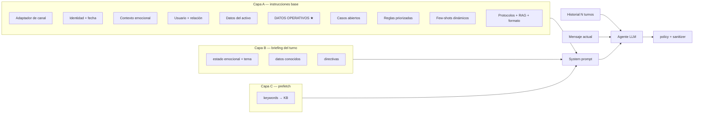
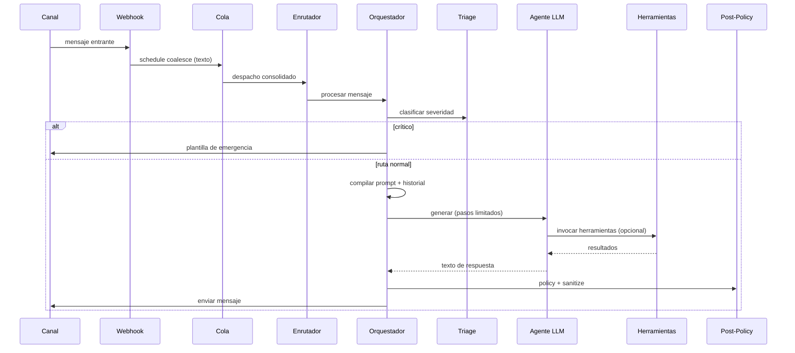

# Especificación técnica: agente conversacional en capas

Documento de ingeniería y arquitectura de un **agente conversacional de producción** organizado como pipeline en capas. Describe el **patrón replicable** (orquestación, control del prompt, herramientas, RAG, escalamiento) separado de la **lógica de negocio** de cada dominio.

**Tutorial de arquitectura del prompt:** [prompt-guide.md](./prompt-guide.md) — principios fundamentales, ensamblaje capa por capa, receta paso a paso y checklist de auditoría.

---

## Documentación relacionada

| Documento | Audiencia | Contenido |
|-----------|-----------|-----------|
| [prompt-guide.md](./prompt-guide.md) | Arquitectos, ML engineers | **Cómo se construye el prompt**, principios replicables, L0/L1/L2, briefing del turno, post-policy |
| Este documento | Backend, DevOps, QA | Pipeline end-to-end, contratos, herramientas, observabilidad, despliegue |

---

## 1. Resumen ejecutivo

Un agente conversacional bien diseñado es un **orquestador de conversación** que:

1. Recibe mensajes multicanal (texto, audio, imagen)
2. Aplica reglas determinísticas **antes** y **después** del LLM
3. Delega redacción y decisiones de herramientas al modelo
4. Gobierna tono, seguridad, datos sensibles, escalamiento y formato de salida

No es un chatbot monolítico: es un **pipeline en capas** donde cada capa tiene responsabilidad única:

| Capa | Responsabilidad | Determinística / LLM |
|------|-----------------|----------------------|
| Entrada | Webhook, debounce, identificación de contacto | Determinística |
| Pre-LLM | Triage de seguridad, atajos, prefetch, briefing del turno | Híbrida |
| Core | Agente LLM + herramientas + prompt dinámico | LLM |
| Post-LLM | Política de respuesta, sanitización, envío | Determinística |
| Efectos secundarios | Escalamiento, casos abiertos, métricas, alertas | Determinística |

**Principio de diseño central:** el LLM redacta; el sistema **gobierna**.

**Los cinco principios replicables** (detalle en el tutorial de prompt):

1. **Hidratar antes de inferir** — contexto del contacto resuelto antes del LLM
2. **Separar verdad, reglas y razonamiento** — bloques modulares en el system prompt
3. **Determinismo donde importa la confianza** — triage, briefing, policy, guardrails en herramientas
4. **Conocimiento en tres velocidades** — L0 inline, L1 prefetch, L2 RAG bajo demanda
5. **Salida no confiable** hasta policy + sanitizer

---

## 2. Stack tecnológico (referencia)

Los componentes concretos varían por proyecto. Patrón típico:

| Componente | Rol | Alternativas comunes |
|------------|-----|----------------------|
| Runtime del agente | Orquestación LLM + tool calling | Framework de agentes, SDK de IA |
| Modelo de chat | Generación y visión | Cualquier proveedor compatible |
| Embeddings | RAG semántico | Modelo pequeño de embeddings + vector store |
| Transcripción | Notas de voz | Servicio STT del proveedor |
| Clasificación de imagen | Señales pre-triage | Modelo de visión ligero |
| Cola / debounce | Coalescing de mensajes | Cola asíncrona, job scheduler |
| Persistencia | Conversaciones, KB, casos | Base de datos relacional u OLTP |
| Observabilidad | Logs, métricas, trazas | Logger estructurado, APM, Prometheus |
| Canal de salida | Entrega al usuario | API de mensajería, email, webhook |

---

## 3. Posición en la arquitectura global

```
Canal entrante (webhook / polling / websocket)
        │
        ├─ Resolver identidad del contacto
        ├─ Obtener o crear conversación
        ├─ Persistir mensaje entrante
        ├─ ¿Modo manual activo? → detener
        ├─ ¿Mensajes fragmentados? → debounce en cola
        │         └─► Despacho consolidado → enrutador
        └─ else → enrutador por tipo de contacto
                        │
                        └─► Orquestador del agente
```

**Puntos de entrada alternativos** (mismo pipeline):

- Enrutador central por tipo de contacto (cliente, prospecto, operador)
- Promoción de contacto anónimo a identificado
- Entorno sandbox para pruebas sin canal real
- Adaptador de canal secundario (marketplace, OTA, widget) reutilizando el núcleo de prompt

---

## 4. Contratos de datos

### 4.1 Entrada: mensaje normalizado

Estructura mínima independiente del canal:

| Campo | Descripción |
|-------|-------------|
| `type` | `text` \| `audio` \| `image` \| … |
| `text` | Cuerpo o caption |
| `media_ref` | Referencia a media si aplica |
| `from` | Identificador del remitente |
| `message_id` | Idempotencia y deduplicación |

### 4.2 Contexto: contacto enriquecido

Objeto construido **antes** del agente. El LLM **no debería consultar en caliente** los datos operativos básicos: vienen resueltos aquí e inyectados al prompt.

Bloques típicos:

- Identidad del usuario y preferencias
- Relación activa (reserva, contrato, pedido, ticket)
- Activo asociado (propiedad, producto, servicio)
- Datos operativos verbatim (credenciales, precios, procedimientos)
- Metadatos de canal

### 4.3 Estado: conversación

| Campo | Valores / rol |
|-------|---------------|
| `id` | Identificador persistente |
| `estado` | activa, pausada, esperando_confirmación, cerrada |
| `modo_agente` | AUTO \| MANUAL — en MANUAL el webhook no invoca el agente |
| `contexto` | JSON con flujo activo, datos parciales, origen |

---

## 5. Pipeline del orquestador

Flujo secuencial con **early returns** en rutas críticas.

### Fase A — Observabilidad inicial

- Timestamp de inicio
- Zona horaria del negocio
- Contadores de outcome al final de cada rama (éxito, vacío, error)

### Fase B — Señales multimodales + triage pre-LLM

1. **Imagen:** clasificación ligera → categorías operativas (filtración, fallo de acceso, electrodoméstico, general)
2. **Texto enriquecido:** mensaje + señales de imagen si aplica
3. **Triage determinístico** (regex, no LLM):
   - Severidad: crítica | urgente | normal
   - Categoría según dominio
   - Lista de frases ambiguas para evitar falsos positivos

### Fase C — Registro automático de caso (política diferencial)

Cuando la severidad no es normal y la política lo permite:

- Crear caso abierto
- Actualizar estado del contacto
- Notificar operador humano
- Mantener modo AUTO si no es crítico (el agente sigue respondiendo)

### Fase D — Respuesta de emergencia (corte total del LLM)

Si severidad crítica:

1. Enviar plantilla determinística con instrucciones de seguridad
2. Incluir contacto de urgencia según política y hora
3. **Return** — una sola voz; el LLM no genera segundo mensaje

### Fase E — Atajos determinísticos

Peticiones reconocibles por patrón (enlace de registro, código de confirmación):

1. Resolver valor desde base de datos
2. Responder directo sin LLM
3. **Return**

### Fase F — Ensamblaje del contexto para el LLM

| Paso | Componente | Output |
|------|------------|--------|
| Casos abiertos | Consulta DB (máx. 3) | Inyectados al prompt |
| Historial | Últimos N turnos | `{ role, content }[]` |
| Briefing del turno | Compilador heurístico | Bloque de lectura interna |
| Prefetch | Keywords → KB | Entradas precargadas |
| Instrucciones base | Compilador principal | System prompt |
| Herramientas | Factory con contexto enlazado | Conjunto bound al contacto |

Ensamblaje del system prompt:

```
system_prompt = [instrucciones_base, briefing_turno, prefetch]
  .filter(no_vacío)
  .join('\n\n')
```

### Fase G — Input multimodal

| Tipo | Input al agente |
|------|-----------------|
| Texto | historial + `{ role: 'user', content: texto }` |
| Audio | Transcripción prefijada como nota de voz |
| Imagen | Texto + referencia de imagen para visión |

### Fase H — Generación con reintentos

Parámetros recomendados:

- Pasos máximos (tool loop): 2–4
- Tokens de salida máx.: 400–800 según canal
- Reintentos: 2–3 con backoff exponencial + jitter

### Fase I — Post-procesamiento de salida

Cadena estricta:

1. Respuesta vacía → log + métrica → **no enviar**
2. Normalización de formato del canal (negritas, markdown)
3. Política de respuesta — reglas pragmáticas (ver §8)
4. Sanitizador — elimina IDs internos, jerga de sistema
5. Silencio intencional (ack puro) → no enviar
6. Detector de fugas internas → warning en logs
7. Envío al canal

### Fase J — Error global

Catch: alerta + mensaje de fallback con contacto de soporte público.

---

## 6. Arquitectura del prompt

> **Tutorial completo:** [guest-agent-arquitectura-prompt.md](./guest-agent-arquitectura-prompt.md)

El prompt **no es estático**. En cada turno se **compila** a partir de datos de DB, reglas priorizadas, briefing heurístico y conocimiento precargado.

### 6.1 Diagrama de ensamblaje



### 6.2 Capa A — Instrucciones base

| Sub-bloque | Rol en la precisión |
|------------|---------------------|
| A0 Adaptador de canal | Reglas duras por superficie (marketplace, email…) |
| A1 Identidad + fecha | Anclaje temporal y de rol |
| A2 Contexto emocional | Tono adaptativo (incidente, celebración) |
| A3 Usuario + relación | Evita repreguntar fechas, unidad, canal |
| A4 Datos del activo | Información estable del objeto de la conversación |
| **A5 DATOS OPERATIVOS** | **Clave:** valores exactos — *USAR VERBATIM* |
| A6 Casos abiertos | Continuidad sin IDs al usuario |
| A7 Reglas 1–5 | Humano, intención, espejo, 1 pregunta, no inventar |
| A8 Few-shots | Calibra tono con datos reales del contacto |
| A9 Protocolos | Escalamiento, herramientas, RAG, formato de canal |

#### Conocimiento en tres velocidades

| Nivel | Mecanismo | Cuándo |
|-------|-----------|--------|
| **L0** | Datos inline en prompt | Códigos, precios, horarios frecuentes |
| **L1** | Prefetch por keywords | Temas detectables por regex |
| **L2** | RAG bajo demanda | Preguntas abiertas; retorna scores de relevancia |

### 6.3 Capa B — Briefing del turno

Heurística **sin LLM**. Produce bloque de lectura interna con:

- Estado emocional estimado
- Tema activo
- Intención probable
- Datos conocidos (no repreguntar)
- Directivas y guía de escalamiento

**Patrón replicable:** más barato y auditable que un segundo LLM de planificación.

### 6.4 Capa C — Prefetch de conocimiento

1. Patrones regex → etiqueta de tema (máx. 2 por turno)
2. Consulta léxica a KB → hasta 3 entradas por etiqueta
3. Inyección al prompt con regla "responder directo si cubre la consulta"

### 6.5 Reglas de comportamiento (orden de prioridad)

| # | Regla | Efecto |
|---|-------|--------|
| 1 | Suena humano, no plantilla | Sin menús "¿X, Y o Z?" |
| 2 | Lee la intención | Saludo / ack / pregunta / queja / fragmento |
| 3 | Espejo de longitud | Borrador ≤ 3× longitud del input |
| 4 | Máximo una pregunta | Prohibido "¿X o Y?" |
| 5 | No inventes, no prometas | Escala con honestidad |

Además: continuidad de tema, anti-patrones con ejemplos, protocolo RAG con scores.

### 6.6 Adaptadores de canal y alcance de datos

Conceptos del adaptador:

- **Modo de canal** — superficie de salida
- **Alcance de datos** — qué bloques operativos incluir según triage o contexto
- **Modo operativo** — datos completos vs. filtrados por tema

| Escenario | Modo operativo | Comportamiento |
|-----------|----------------|----------------|
| Canal directo identificado | completo | Datos operativos íntegros |
| Canal secundario identificado | completo | Paridad con canal principal |
| Prospecto / restricción marketplace | filtrado + alcance | Solo datos del scope detectado; encabezado estricto |

**Patrón replicable:** núcleo compartido + adaptador por canal + filtro de alcance.

### 6.7 Parámetros de generación

| Parámetro | Valor orientativo | Razón |
|-----------|-------------------|-------|
| Historial | 10–20 turnos | Continuidad sin inflar contexto |
| Tokens salida máx. | 400–800 | Concisión acorde al canal |
| Pasos máx. | 2–4 | Limita costo y latencia |
| Reintentos | 2–3 con backoff | Resiliencia |

### 6.8 Qué va y qué no va en el system prompt

| Elemento | Ubicación |
|----------|-----------|
| Datos, reglas, briefing, prefetch | System prompt (capas A+B+C) |
| Historial | Array de mensajes |
| Mensaje actual | Último turno user |
| Resultados de herramientas | Loop del agente |
| Correcciones de tono/leaks | Post-LLM |

---

## 7. Briefing del turno (pre-LLM heurístico)

Componente sin LLM. Estructura de salida recomendada:

```
TurnBriefing {
  mood                    // happy | neutral | frustrated | urgent | crisis
  active_topic            // string
  likely_intent           // string
  known_facts[]           // datos que no hay que repreguntar
  data_first_directives[] // revisar datos antes de herramientas
  response_directives[]   // tono y acciones del turno
  escalation_guidance[]   // cuándo escalar vs. responder
  accumulated_issues      // contador de problemas acumulados
  crisis_protocol         // booleano
}
```

**Por qué existe:** reduce alucinaciones y repreguntas duplicando en prompt lo que ya está en contexto/historial.

---

## 8. Política de respuesta (post-LLM)

Aplica transformaciones **después** de la generación.

### 8.1 Cortocircuitos

| Señal | Acción |
|-------|--------|
| Ack puro ("ok", "gracias", emoji) | 1 línea o silencio |
| Saludo puro | Saludo cálido de 1 línea |
| Tema resuelto | Cierre limpio |

### 8.2 Transformaciones

- Eliminar promesas no soportadas
- Eliminar frases huecas corporativas
- Máximo 1 pregunta por mensaje
- Espejo de longitud (respuesta ≤ 3× input corto)
- Control de datos sensibles según política del dominio
- Límites de formato del canal (negritas, markdown)

### 8.3 Sanitizador

- Elimina UUIDs, IDs internos, nombres de herramientas, modos internos
- Idempotente
- Detector de fugas para alertas

**Patrón replicable:** tratar la salida del LLM como **texto no confiable** hasta pasar policy + sanitizer.

---

## 9. Sistema de herramientas

Herramientas creadas por **factory con contexto enlazado** — el LLM no recibe IDs de sesión; están bound en runtime.

### 9.1 Inventario típico por rol

| Rol | Propósito | Efectos secundarios |
|-----|-----------|---------------------|
| Consulta KB | RAG semántico + léxico | Métrica de miss |
| Enlace / recurso | Entregar URL o código | Lookup DB |
| Disponibilidad | Verificar slots, stock, cupos | API externa |
| Escalamiento humano | Pasar a operador | Email, modo MANUAL, pausa |
| Emergencia | Caso crítico | Caso + escalamiento |
| Inconveniente grave | Servicio esencial caído | Caso + escalamiento |
| Abrir caso | Registro genérico | DB + escalamiento |
| Seguimiento de caso | Nota en caso existente | Update DB |
| Cerrar caso | Resolución | Normaliza estado |
| Actualizar contexto | Celebración, motivo, preferencia | Update emocional |

### 9.2 Guardrails en ejecución (no solo en prompt)

Ejemplo en herramienta de escalamiento:

- Consulta puramente informativa → omitir, devolver respuesta sugerida
- Tema ya resuelto → omitir
- Falta dato obligatorio → pedir dato, no escalar

Ejemplo en herramienta de inconveniente:

- Dato ya en contexto operativo → omitir
- Dedupe de casos en ventana temporal

**Patrón replicable:** `{ omitido: true, motivo, respuesta_sugerida }` para guiar al modelo sin side effect.

### 9.3 RAG — herramienta de consulta KB

Flujo:

1. Embedding de keywords → búsqueda vectorial (distancia coseno)
2. Enriquecer con relevancia: alta (≤0.30), media (≤0.45), baja (>0.45)
3. Fallback búsqueda léxica
4. Retornar flags de refinamiento y sugerencias de keywords

Prefetch en paralelo (Capa C):

- Regex de keywords fuertes → query directa a KB
- Inyecta al prompt **antes** de que el LLM decida invocar la herramienta

---

## 10. Escalamiento humano

Secuencia atómica típica:

1. Notificación al operador (email, Slack, dashboard)
2. Cambio a modo MANUAL (salvo política de mantener AUTO en no críticos)
3. Pausa de conversación + contexto JSON
4. Backup por canal alternativo si aplica

**Interacción con agente:** tras escalamiento en modo MANUAL, el webhook deja de invocar el agente.

---

## 11. Coalescing de mensajes (debounce)

**Problema:** usuarios envían varios mensajes cortos seguidos.

**Solución:**

1. Webhook agenda job en cola con ventana configurable (5–10 s)
2. Al disparar: concatena inbound desde último outbound
3. Lock por conversación (advisory lock o similar)
4. Dedupe por ID de mensaje sintético
5. Descarta si llegó mensaje más nuevo (stale)

**Patrón replicable:** debounce asíncrono con cola + idempotencia, no sleep en webhook.

---

## 12. Observabilidad

### 12.1 Logs estructurados

Eventos clave por turno:

- Mensaje recibido / respondido
- Respuesta vacía intencional
- Error del agente
- Audio transcrito / imagen procesada

### 12.2 Métricas

- Runs totales por outcome (success, error, empty)
- Escalamientos por categoría y severidad
- KB miss (FAQ no encontrada)
- First aid / respuestas de emergencia
- Latencia por percentil
- Casos abiertos activos

### 12.3 Alertas

Captura en: transcripción, descarga de media, error global del agente, fugas internas detectadas.

---

## 13. Configuración

Variables típicas (nombres adaptables):

| Variable | Efecto |
|----------|--------|
| Modelo del agente | Selección de LLM |
| API key del proveedor | LLM, embeddings, visión, STT |
| Triage habilitado | Seguridad pre-LLM |
| Teléfonos de emergencia | Fallback por severidad/hora |
| Email de escalamiento | Destino operador |
| Parámetros de coalescing | Ventana de debounce |
| URL base de la app | Target de jobs en cola |

---

## 14. Diagrama de secuencia (turno típico)



---

## 15. Mapa de componentes

```
Orquestador del agente
├── Compilador de instrucciones base
├── Registro de herramientas + RAG
├── Triage de seguridad
├── Plantillas de emergencia
├── Compilador de briefing del turno
├── Política de respuesta
├── Prefetch de conocimiento
├── Clasificador de imágenes (pre-triage)
├── Sanitizador de salida
├── Cargador de historial
├── Escalamiento humano
├── Selector de contacto de urgencia
├── Coalescer de mensajes entrantes
├── Enrutador por tipo de contacto
└── Adaptador sandbox

Adaptador de canal secundario
└── Reutiliza núcleo + encabezado específico

Métricas / observabilidad
Transcripción / visión
Envío al canal
```

---

## 16. Guía de replicación

> **Empezar aquí:** [guest-agent-arquitectura-prompt.md](./guest-agent-arquitectura-prompt.md) §10 (receta) y §14 (checklist).

### 16.1 Qué conservar (ingeniería)

1. Pipeline en capas con early returns
2. Triage determinístico pre-LLM
3. Prompt compilado: Capa A + B + C
4. Conocimiento L0/L1/L2
5. Herramientas con contexto enlazado + guardrails en ejecución
6. Post-policy + sanitizer obligatorios
7. Escalamiento centralizado con cambio de modo
8. Coalescing para mensajes fragmentados
9. Métricas por outcome
10. Sandbox con mismo pipeline
11. Adaptadores de canal sin duplicar núcleo

### 16.2 Qué adaptar (negocio)

| Área | Ejemplo hospitality | Otro dominio |
|------|---------------------|--------------|
| Contexto del contacto | huésped + propiedad + unidad | cliente + cuenta + producto |
| Datos operativos | WiFi, acceso, amenidades | SLA, precios, procedimientos |
| Reglas de triage | fuego, gas, filtración | categorías de riesgo del dominio |
| Herramientas | extensión estadía, registro | acciones del CRM/ERP |
| Base de conocimiento | por unidad/propiedad | por producto/región |
| Canal | mensajería + marketplace | Slack, email, widget |
| Plantillas de emergencia | runbooks del sector | runbooks del sector |

### 16.3 Checklist mínimo para MVP

- [ ] Contexto del contacto resuelto antes del agente
- [ ] Historial como messages, no en system prompt
- [ ] System prompt dinámico: capas A + B + C
- [ ] Bloque DATOS OPERATIVOS con instrucción *USAR VERBATIM*
- [ ] ≥1 herramienta KB con scores de relevancia
- [ ] Prefetch determinístico para top-N temas
- [ ] ≥1 herramienta de escalamiento con omisiones en código
- [ ] Post-policy + sanitizer
- [ ] Modo manual que detenga automatización
- [ ] Logs + contador de runs + latencia
- [ ] Tests unitarios por capa
- [ ] Adaptador de canal por superficie

### 16.4 Anti-patrones evitados

| Anti-patrón | Mitigación |
|-------------|------------|
| LLM como única defensa | Triage + policy + sanitizer + guardrails |
| Prompt estático sin datos | Bloques por contacto/turno |
| Escalar en cada duda | Omisiones en herramientas + directivas data-first |
| Doble mensaje en crisis | Early return post emergencia |
| RAG ciego | Distancia coseno + instrucciones de refinamiento |
| Promesas no ejecutables | Regex post-LLM |

---

## 17. Testing

| Nivel | Qué cubrir |
|-------|------------|
| Unit — policy | Acks, teléfonos, brevedad |
| Unit — briefing | Tema activo, mood, datos conocidos |
| Unit — KB / RAG | Scores de relevancia |
| Unit — compilador de instrucciones | Bloques, modos de canal, datos verbatim |
| Integración | Pipeline completo con mocks |
| E2E | Webhook → agente → envío |
| CI periódico | Evals automatizados del agente |

---

## 18. Decisiones de diseño (ADRs implícitos)

1. **Framework de agentes vs SDK directo:** unifica agente + tools + steps; límite de pasos controla costo/latencia.
2. **Triage regex vs clasificador LLM:** auditable, rápido, predecible en emergencias.
3. **Límite bajo de tokens de salida:** fuerza concisión alineada con mensajería.
4. **Respuesta vacía permitida:** mejor silencio que mensaje genérico (acks, marketplaces).
5. **Política de casos diferencial:** separa registro automático de severidad del comportamiento conversacional.
6. **Mantener AUTO en escalamiento no crítico:** el usuario sigue recibiendo auto-respuestas mientras el operador interviene.

---

*Especificación del patrón de agente conversacional en capas. Para el diseño del prompt, ver [guest-agent-arquitectura-prompt.md](./guest-agent-arquitectura-prompt.md).*
