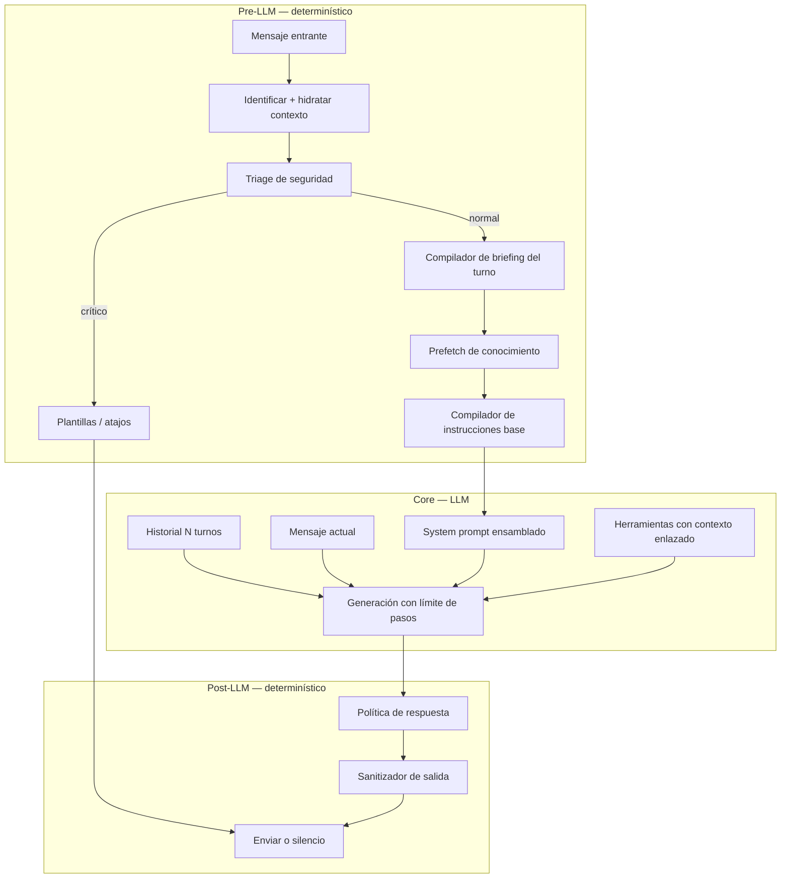

# Arquitectura del prompt: tutorial para agentes conversacionales

Guía de ingeniería sobre **cómo se construye, gobierna y entrega** el system prompt de un agente conversacional de producción. Está pensada como tutorial: explica los **principios fundamentales** y el **patrón replicable** para cualquier dominio (hospitality, soporte SaaS, salud, logística, retail, etc.).

**Documento complementario:** [guest-agent-especificacion-tecnica.md](./guest-agent-especificacion-tecnica.md) — pipeline completo, tools, observabilidad y despliegue.

---

## 1. La tesis central

> **El LLM redacta; el sistema gobierna.**

Un agente conversacional de producción no es un `system prompt` estático. Es un **compilador de contexto** que, en cada turno, ensambla:

1. **Datos estructurados** (verdad de negocio desde la base de datos)
2. **Reglas de comportamiento** (priorizadas, con ejemplos)
3. **Briefing del turno** (heurística determinística)
4. **Conocimiento recuperado** (prefetch + RAG bajo demanda)
5. **Historial conversacional** (memoria de corto plazo)
6. **Capas post-LLM** (política + sanitización antes de enviar)

La precisión del agente — respuestas concretas, breves y específicas — no viene de un prompt largo, sino de **dar la respuesta en el contexto** y **restringir cómo se redacta**.

---

## 2. Los cinco principios fundamentales

Estos principios son independientes del dominio. Son la base para diseñar cualquier agente similar.

### Principio 1: Hidratar antes de inferir

El agente **no debería adivinar** datos operativos en cada turno. Un **objeto de contexto del contacto** se construye **antes** de invocar al LLM e incluye:

- Identidad del usuario
- Estado del servicio, reserva o contrato
- Datos operativos verbatim (códigos, precios, horarios, procedimientos)
- Metadatos de canal (mensajería, marketplace, email, widget web)

**Patrón replicable:** define un esquema de contexto por dominio y un paso de **resolución de identidad** que lo llene desde tu CRM, ERP o base de datos. El prompt solo **formatea** lo que ya existe; no sustituye la consulta de datos.

### Principio 2: Separar verdad, reglas y razonamiento

| Capa | Qué es | Quién la produce | Ejemplo |
|------|--------|------------------|---------|
| **Verdad** | Hechos del negocio | Base de datos → formateador | Credenciales de acceso, precio de un servicio |
| **Reglas** | Cómo hablar y actuar | Plantilla de instrucciones + few-shots | "Máximo 1 pregunta por mensaje" |
| **Razonamiento del turno** | Qué importa *ahora* | Heurística pre-LLM | "Tema activo: facturación; no repreguntar plan actual" |

Mezclar las tres en un solo bloque de texto confunde al modelo. Este diseño las mantiene **modulares y auditables**.

### Principio 3: Determinismo donde importa la confianza

Usa código (regex, reglas, early returns) para:

- Seguridad y compliance (triage de emergencias)
- Atajos con respuesta exacta (enlaces, códigos de confirmación)
- Briefing del turno (estado emocional, tema activo, datos ya conocidos)
- Post-procesamiento (acks, brevedad, filtrado de datos internos)

Usa el LLM para:

- Redacción natural en el tono correcto
- Resolución semántica de referencias elípticas ("y cuánto?")
- Decidir cuándo invocar herramientas
- Interpretar imágenes y mensajes ambiguos

**Regla práctica:** si un error cuesta dinero, reputación o seguridad → **no confíes solo en el prompt**.

### Principio 4: Conocimiento en tres velocidades

| Velocidad | Mecanismo | Cuándo usar |
|-----------|-----------|-------------|
| **L0 — Inline** | Datos en el prompt (bloque operativo) | Respuestas frecuentes, valores exactos |
| **L1 — Prefetch** | Palabras clave → consulta a KB → inyectar en prompt | Temas recurrentes detectables por regex |
| **L2 — RAG bajo demanda** | Herramienta con embeddings + scores de relevancia | Preguntas abiertas o temas no mapeados |

El modelo ve la respuesta **antes** de decidir si inventa. El prefetch (L1) es el truco más subestimado para recall determinístico sin costo extra de embedding por turno.

### Principio 5: Salida no confiable hasta policy + sanitizer

Trata la respuesta del LLM como borrador. Antes de enviarla al usuario:

1. **Política de respuesta** — corrige tono, longitud, promesas imposibles, datos sensibles no autorizados
2. **Sanitizador** — elimina identificadores internos, UUIDs, jerga de sistema
3. **Silencio permitido** — respuesta vacía es válida (acks, canales con restricciones de marketplace)

---

## 3. Vista de arquitectura completa



---

## 4. Ensamblaje del system prompt (capa por capa)

En cada turno, el system prompt final es la concatenación de **tres bloques**:

```
system_prompt = [
  instrucciones_base(contexto, opciones),   // Capa A
  briefing_del_turno(razonamiento),         // Capa B
  conocimiento_precargado(prefetch),        // Capa C
].filter(no_vacío).join('\n\n')
```

### Capa A — Instrucciones base (núcleo)

Componente que compila el prompt principal a partir del contexto del contacto. Estructura interna recomendada:

```
┌─────────────────────────────────────────────────────────┐
│ A0. Adaptador de canal (opcional)                         │
│     Reglas duras por superficie (marketplace, email…)   │
├─────────────────────────────────────────────────────────┤
│ A1. Identidad + anclaje temporal                        │
│     Rol del agente, nombre del servicio, fecha/hora     │
├─────────────────────────────────────────────────────────┤
│ A2. Contexto emocional / situacional                    │
│     Incidente, celebración, urgencia previa             │
├─────────────────────────────────────────────────────────┤
│ A3. Datos del sujeto (usuario + relación activa)        │
│     Nombre, fechas, etapa, canal, identificador público │
├─────────────────────────────────────────────────────────┤
│ A4. Datos del activo (producto, propiedad, pedido…)     │
│     Información estable del objeto de la conversación   │
├─────────────────────────────────────────────────────────┤
│ A5. DATOS OPERATIVOS ★                                  │
│     Valores exactos — USAR VERBATIM                     │
├─────────────────────────────────────────────────────────┤
│ A6. Estado operativo (casos abiertos, tickets…)         │
│     Lenguaje interno; no exponer IDs al usuario         │
├─────────────────────────────────────────────────────────┤
│ A7. Reglas de comportamiento (priorizadas)              │
│     Principios 1-5, continuidad, anti-patrones          │
├─────────────────────────────────────────────────────────┤
│ A8. Few-shots internos                                  │
│     Ejemplos con datos reales del contacto actual       │
├─────────────────────────────────────────────────────────┤
│ A9. Protocolos operativos + herramientas + RAG + formato│
└─────────────────────────────────────────────────────────┘
```

#### A0 — Adaptador de canal

Patrón **núcleo + adaptador**: el núcleo es compartido; cada canal añade reglas duras.

| Superficie | Comportamiento típico del adaptador |
|------------|-------------------------------------|
| Mensajería directa | Datos operativos completos; silencio opcional en acks |
| Marketplace / OTA | Restricciones de plataforma; respuesta vacía permitida; sin markdown |
| Widget web / email | Formato y tono del canal; límites de longitud distintos |

Parámetros conceptuales del adaptador:

- **Modo de canal** — qué superficie recibe la respuesta
- **Alcance de datos** — qué bloques operativos incluir según el contexto del turno
- **Modo operativo** — datos completos vs. filtrados por tema detectado

**Patrón replicable:** un encabezado de canal por superficie. No dupliques el núcleo de instrucciones.

#### A5 — DATOS OPERATIVOS (la clave de la precisión)

Bloque generado desde el contexto del contacto. Ejemplos de campos según dominio:

- Hospitality: credenciales WiFi, códigos de acceso, costos de amenidades
- SaaS: límites del plan, estado de la suscripción, procedimientos de soporte
- Logística: tracking, ventana de entrega, instrucciones de recepción

Instrucción explícita en el prompt:

> Si el dato está en DATOS OPERATIVOS, **responde directo**. No invoques la base de conocimiento ni escales.

**Patrón replicable:** mapea los 15–30 campos que tu operación repite en el 80% de las consultas. Formatea como lista `- Campo: valor`. Marca `"No registrado"` cuando falte — nunca dejes huecos que el modelo rellene.

#### A7 — Reglas de comportamiento (orden de prioridad)

Las reglas deben estar numeradas **en orden de prioridad**. El modelo las procesa como jerarquía, no como lista plana:

| # | Regla | Efecto en la calidad percibida |
|---|-------|--------------------------------|
| 1 | Suena humano, no plantilla | Elimina menús robóticos y párrafos defensivos |
| 2 | Lee la intención antes de responder | Clasifica saludo / ack / pregunta / queja / fragmento |
| 3 | Espejo de longitud | 1 palabra → 1 línea; borrador ≤ 3× input |
| 4 | Máximo una pregunta | Prohibido "¿X o Y?" |
| 5 | No inventes, no prometas | Escala con honestidad; sin seguimiento automático |

**Patrón replicable:** escribe 5 principios no negociables para tu dominio. Usa **anti-patrones con ejemplos malo/bien** — enseñan más que adjetivos ("sé conciso").

#### A8 — Few-shots dinámicos

Los ejemplos deben usar **variables reales** del contacto:

```
Usuario: "¿Cuál es mi límite diario?"
Agente: "Tu plan incluye 10.000 solicitudes por día. Hoy llevas 3.421."
```

Esto calibra tono y longitud mejor que ejemplos genéricos.

**Patrón replicable:** genera 6–10 pares pregunta/respuesta interpolando campos del contexto del contacto.

#### A9 — Protocolo RAG (razonar, no copiar)

Instrucciones explícitas para interpretar la salida de la herramienta de conocimiento:

- **Relevancia global:** alta | media | baja | desconocida
- **Distancia semántica:** 0 = idéntica, 1 = irrelevante
- **Necesita refinamiento:** booleano + sugerencias de keywords

Flujo mental obligatorio para el modelo:

1. ¿Cuál es la pregunta **real** (incluyendo tema del turno anterior)?
2. ¿El fragmento recuperado responde esa pregunta?
3. ¿El tema del fragmento coincide con el tema en curso?
4. Decidir: usar fragmento / re-consultar con keywords / escalar

**Patrón replicable:** nunca digas "usa lo que devuelva el retriever". Siempre incluye umbrales numéricos y un ejemplo de **error real a evitar**.

---

### Capa B — Briefing del turno (compilador heurístico)

Componente **sin LLM** que produce un bloque de lectura interna:

```
LECTURA DEL TURNO (USO INTERNO, NO MOSTRAR AL USUARIO):
- Estado emocional estimado: frustrado
- Tema activo: facturación
- Intención probable: consulta sobre método de pago del tema activo
- Datos ya conocidos que NO debes repreguntar:
  - Plan actual: Pro
- Directivas: ...
- Guía de escalamiento: ...
```

#### Qué detecta

| Señal | Técnica | Ejemplos de salida |
|-------|---------|-------------------|
| Estado emocional | Patrones en el mensaje + triage | satisfecho, neutral, frustrado, urgente, crisis |
| Tema activo | Regex + último turno del agente | facturación, acceso, entrega, cancelación… |
| Intención probable | Regex contextual | pago del tema previo, layout, reserva |
| Datos conocidos | Campos del contexto del contacto | plan, credenciales, canal, estado del caso |
| Crisis acumulada | Contador + patrones | múltiples problemas + mención de reembolso |

#### Por qué existe

- **Más barato** que un segundo LLM de planificación
- **Auditable** — cada heurística puede tener tests unitarios
- **Reduce repreguntas** — el modelo ve explícitamente qué ya sabe
- **Guía escalamiento** — "responder primero si el dato existe"

**Patrón replicable:** estructura mínima del briefing:

```
TurnBriefing {
  mood              // estado emocional estimado
  active_topic      // tema en curso
  known_facts[]     // datos que no hay que volver a pedir
  directives[]      // acciones concretas para este turno
}
```

Empieza con 10–15 patrones de tema por dominio. Itera con logs de conversaciones reales.

---

### Capa C — Prefetch de conocimiento

Pipeline determinístico:

1. **Palabras clave fuertes** — patrones regex → etiquetas de tema
2. Match en mensaje → máximo 2 etiquetas por turno
3. Consulta léxica a la base de conocimiento → hasta 3 entradas por etiqueta
4. Inyección al prompt como bloque precargado

```
CONOCIMIENTO RELEVANTE (USAR ANTES DE PREGUNTAR AL USUARIO):
Tema: facturación
  1) Pregunta: ...
     Respuesta: ...
Regla: si la información de arriba cubre la consulta, RESPONDE DIRECTO.
```

**Patrón replicable:**

1. Lista los 20 temas más frecuentes de tu soporte (tickets, logs)
2. Define regex → etiqueta por tema
3. Precarga desde tu KB antes del LLM
4. Mide: ¿cuántos turnos evitaron invocar RAG?

---

## 5. Lo que NO va en el system prompt

| Elemento | Dónde va | Por qué |
|----------|----------|---------|
| Historial | Array de mensajes `{ role, content }` | Separar memoria de instrucciones |
| Mensaje actual | Último turno del usuario | Evita confundir instrucción con input |
| Imagen / audio | Input multimodal del turno | Transcripción/visión en el turno, no en system |
| Resultados de herramientas | Mensajes de tool en el loop del agente | Contexto dinámico post-decisión |

Parámetros de generación recomendados:

| Parámetro | Valor orientativo | Razón |
|-----------|-------------------|-------|
| Historial | 10–20 turnos | Continuidad semántica sin inflar contexto |
| Tokens de salida máx. | 400–800 | Fuerza concisión acorde al canal |
| Pasos máx. (tool loop) | 2–4 | Limita costo y latencia |
| Reintentos | 2–3 con backoff | Resiliencia ante rate limits |

---

## 6. Pre-LLM: rutas que nunca llegan al prompt

Early returns **antes** de ensamblar el prompt:

| Ruta | Condición típica | Respuesta |
|------|------------------|-----------|
| Respuesta de emergencia | Severidad crítica en triage | Plantilla determinística + contacto de urgencia |
| Atajo operativo | Petición reconocible (enlace, código) | Valor desde DB, sin LLM |
| Modo manual | Operador humano activo | El orquestador no invoca el agente |
| Restricción de canal | Marketplace exige intervención humana | Sin generación automática |

**Patrón replicable:** identifica 2–3 rutas donde una sola voz y respuesta exacta son obligatorias. Implementa como código, no como instrucción al modelo.

---

## 7. Post-LLM: policy + sanitizer

### 7.1 Política de respuesta

El LLM propone; la política corrige.

**Cortocircuitos** (reemplazan respuesta completa):

| Señal | Acción |
|-------|--------|
| Ack puro (`ok`, `gracias`, emoji de confirmación) | 1 línea o silencio |
| Saludo puro | Saludo cálido de 1 línea |
| Tema resuelto | Cierre limpio |

**Transformaciones**:

- Eliminar promesas no ejecutables ("te aviso cuando tenga novedades")
- Espejo de longitud — recortar si respuesta > 3× input
- Máximo 1 pregunta por mensaje
- Control de datos sensibles (teléfonos, identificadores) según política del dominio
- Suavizar preguntas binarias no solicitadas

### 7.2 Sanitizador de salida

- Elimina UUIDs, IDs internos, nombres de herramientas, modos de operación internos
- Idempotente (aplicar dos veces produce el mismo resultado)
- Detector de fugas para alertas en logs

**Patrón replicable:** define una lista de patrones prohibidos en salida al usuario. Testea con respuestas reales del modelo como fixtures.

---

## 8. Herramientas: extensión del prompt con guardrails en código

Las herramientas no sustituyen el prompt; lo **complementan** para acciones con efectos secundarios.

Patrón: **factory con contexto enlazado**

```
herramientas = crear_herramientas(contexto_contacto, estado_conversacion)
```

El LLM no recibe identificadores de sesión — están enlazados en tiempo de ejecución.

### Guardrails en la ejecución, no solo en el prompt

Ejemplo en herramienta de escalamiento:

- Consulta puramente informativa con dato ya en contexto → omitir escalamiento, devolver respuesta sugerida
- Tema ya resuelto por el usuario → omitir
- Falta un dato obligatorio para actuar → pedir dato, no escalar

**Patrón replicable:** cada herramienta de acción debe poder retornar `{ omitido: true, motivo, respuesta_sugerida }` para guiar al modelo sin ejecutar el efecto secundario.

---

## 9. Por qué responde concreto y específico (síntesis)

| Mecanismo | Qué evita | Capa |
|-----------|-----------|------|
| Datos operativos verbatim | Inventar credenciales, precios, procedimientos | A5 |
| Prefetch de conocimiento | Depender del retriever en temas frecuentes | C |
| Briefing del turno | Repreguntar datos ya en contexto | B |
| Clasificación pragmática | Responder con menú ante "hola" | A7 regla 2 |
| Espejo de longitud | Párrafos ante "ok" | A7 regla 3 + post-policy |
| Continuidad semántica | "¿pago de qué?" cuando el tema ya estaba claro | Bloque continuidad |
| Protocolo RAG con scores | Fragmento irrelevante para la pregunta real | A9 |
| Anti-patrones con ejemplos | Tono corporativo defensivo | A7 |
| Post-policy | Promesas falsas, datos sensibles prematuros | §7 |
| Guardrails en herramientas | Escalar por preguntas informativas | §8 |

---

## 10. Receta: construir un agente equivalente en otro dominio

### Paso 1 — Define el esquema de contexto del contacto

Estructura mínima:

```
ContactContext {
  user        // identidad, locale, preferencias
  relationship // contrato, reserva, pedido, cuenta
  asset       // producto, propiedad, servicio
  operational // datos verbatim para el prompt
}
```

Un único paso de resolución de identidad antes del agente.

### Paso 2 — Mapea campos operativos verbatim

Lista los 20 datos que el 80% de consultas piden. Formato:

```
DATOS OPERATIVOS (USAR VERBATIM, NO PARAFRASEAR):
- Plan actual: Pro (renueva 2026-07-01)
- Límite API: 10.000 req/día (uso hoy: 3.421)
- SLA respuesta: 4h laborables
```

### Paso 3 — Escribe 5 principios + anti-patrones

Copia la estructura numerada. Añade 4–6 ejemplos malo/bien de tu dominio.

### Paso 4 — Implementa el briefing del turno

Empieza con estado emocional + tema activo + datos conocidos. Añade patrones por tema de consulta.

### Paso 5 — Prefetch de base de conocimiento

Palabras clave fuertes → consulta directa → inyectar en prompt.

### Paso 6 — Herramienta de conocimiento + herramienta de escalamiento

RAG con scores de relevancia y distancia. Escalamiento con omisiones en código.

### Paso 7 — Post-policy + sanitizer

Detector de acks, espejo de longitud, patrones de fuga de datos internos.

### Paso 8 — Adaptadores de canal

Un encabezado por superficie sin duplicar el núcleo.

### Paso 9 — Tests unitarios de cada capa

| Componente | Qué testear |
|------------|-------------|
| Compilador de instrucciones | Bloques presentes, datos verbatim, modos de canal |
| Briefing del turno | Tema activo, datos conocidos, estado emocional |
| Prefetch | Keywords → entradas correctas de KB |
| Política | Acks, brevedad, datos sensibles |
| Sanitizer | IDs internos, jerga de sistema |

---

## 11. Tabla de traducción entre dominios

| Concepto genérico | Hospitality | SaaS B2B | Salud | Logística |
|-------------------|-------------|----------|-------|-----------|
| Contexto del contacto | Huésped + propiedad + unidad | Cliente + cuenta + producto | Paciente + cita + servicio | Destinatario + envío + almacén |
| Datos operativos | WiFi, acceso, amenidades | Límites plan, API, procedimientos | Preparación, horarios, urgencias | Tracking, ventanas, instrucciones |
| Prefetch | Amenidades, check-in, restaurantes | Billing, integraciones, SSO | Preparación examen, FAQs | Estados envío, devoluciones |
| Triage seguridad | Emergencias físicas | Abuso, fraude, outage | Emergencia médica | Daño mercancía, accidente |
| Escalamiento | Equipo operativo | Tier 2 / CSM | Enfermera / médico | Supervisor almacén |
| Adaptador de canal | Mensajería vs marketplace | Slack vs Intercom vs email | Portal vs SMS | App vs mensajería |
| Silencio permitido | Ack puro | Thread resuelto | Confirmación cita | Entrega confirmada |

---

## 12. Anti-patrones de diseño (evitar al replicar)

| Anti-patrón | Por qué falla | Alternativa |
|-------------|---------------|-------------|
| Prompt estático de 50 páginas | Sin datos del caso concreto | Prompt dinámico por contacto/turno |
| "Sé conciso" sin espejo de longitud | Modelo ignora adjetivos | Regla 3× + post-policy |
| RAG como única fuente | Recall bajo en temas frecuentes | L0 inline + L1 prefetch + L2 RAG |
| Escalamiento solo en prompt | Modelo escala de más | Omisiones en ejecución de herramientas |
| Historial dentro del system prompt | Confunde instrucciones con memoria | Array de mensajes separado |
| Una sola capa de defensa | Leaks, promesas falsas | Triage + policy + sanitizer + guardrails |
| Segundo LLM para planning | Costo, latencia, opacidad | Briefing heurístico del turno |

---

## 13. Mapa de responsabilidades por componente

```
Orquestador del agente
├── Compilador de instrucciones base     ← Capa A
├── Compilador de briefing del turno     ← Capa B
├── Prefetch de conocimiento             ← Capa C
├── Política de respuesta                ← Post-LLM
├── Sanitizador de salida                ← Post-LLM
├── Registro de herramientas + RAG       ← Tools
└── Triage de seguridad                  ← Pre-LLM (afecta ruta, no siempre el prompt)

Adaptador de canal (por superficie)
└── Reutiliza el mismo ensamblaje + encabezado específico del canal
```

---

## 14. Checklist de auditoría del prompt

Usa esta lista para evaluar si un agente está listo para producción o replicación:

- [ ] ¿Existe contexto del contacto resuelto antes del LLM?
- [ ] ¿Los datos operativos frecuentes van verbatim en el prompt (L0)?
- [ ] ¿Hay prefetch determinístico para temas top-N (L1)?
- [ ] ¿El RAG devuelve scores y el prompt explica cómo usarlos (L2)?
- [ ] ¿Hay briefing heurístico separado de las reglas estáticas?
- [ ] ¿Las reglas tienen orden de prioridad explícito?
- [ ] ¿Hay anti-patrones con ejemplos malo/bien?
- [ ] ¿Hay few-shots con variables del contacto real?
- [ ] ¿El historial va como messages, no dentro del system prompt?
- [ ] ¿Existe post-policy con detector de acks y espejo de longitud?
- [ ] ¿Existe sanitizer de fugas internas?
- [ ] ¿Las herramientas de acción tienen guardrails en código?
- [ ] ¿Hay early returns para rutas críticas sin LLM?
- [ ] ¿Hay tests unitarios por capa?
- [ ] ¿Hay adaptadores de canal sin duplicar el núcleo?

---

*Tutorial de arquitectura del prompt. Para replicar en otro dominio, implementa los 5 principios (§2) y sigue la receta (§10).*
